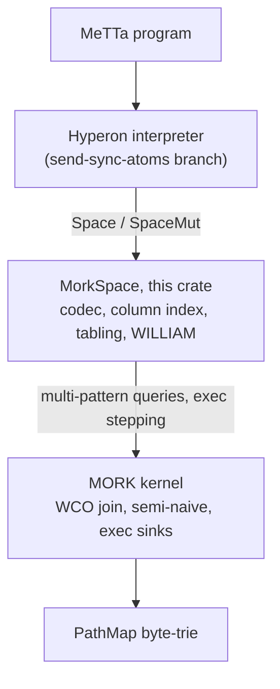
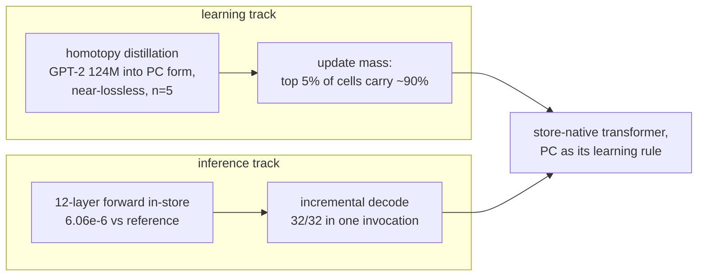
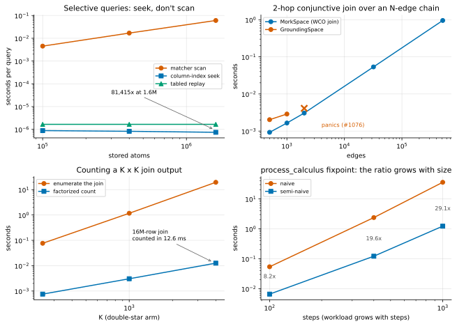
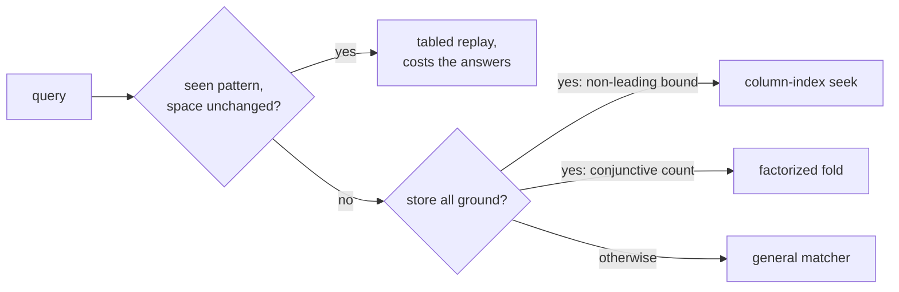

# MeTTa-on-MORK

MeTTa-on-MORK runs a Hyperon atomspace directly on the MORK kernel: `MorkSpace` implements
Hyperon's `Space` and `SpaceMut` traits over MORK's PathMap byte-trie and multi-pattern
matcher, so a MeTTa program evaluates against MORK in the same process, with no network hop
and no serialization boundary between the language and its store.



## Numbers first

Every number in this README was measured on this machine against this exact tree (nightly
Rust, `-C target-cpu=native`), with the command that reproduces it.

| the number | what it is |
|---|---|
| **742 ns** | selective query at 1.6M atoms, 81,415× over the matcher scan |
| **1.66 µs** | repeated-query replay, flat in store size |
| **12.6 ms** | counting a 16,000,000-row join without enumerating it (1,556×) |
| **16 ms** | loading 1M atoms across 16 threads |
| **954 ms** | 2-hop conjunctive query at 512k atoms, output-linear where GroundingSpace panics at 2k (#1076) |
| **94 ms** | `bfc-xp` jarr proof search, against the 40.4 s upstream quote |
| **121/121** | chaining `.metta` programs running on MorkSpace, 120 proven equivalent by tier |
| **27/27** | hyperon's stdlib and scripts test suite, byte-identical with the stdlib hosted in-store |
| **6.06e-6** | max relative logit error of the 12-layer GPT-2 forward running inside the store |

## The transformer programme

The main thing this substrate serves:
[`metta-quantimork-transformer.pdf`](metta-quantimork-transformer.pdf), the technical report
on GPT-2 (124M) re-expressed as a predictive-coding network by homotopy distillation, the
measured rank concentration of its update mass, and the companion result running the same
transformer's forward pass natively inside the MORK store (kernel lineage:
[`metta-on-mork-base`](https://github.com/MesTTo/MORK/tree/metta-on-mork-base)). It is a
work-in-progress report and states what is established and what is not.



## Asymptotics at the bridge



The figure is rendered from the tables below by [`docs/plot_readme_figures.py`](docs/plot_readme_figures.py).

### Conjunctive queries are native worst-case-optimal joins

Each conjunct of `(, q1 .. qn)` becomes one factor of a single kernel multi-pattern query, so
a shared variable is a join variable (`cargo run --release --example conjunctive_join`):

| N | GroundingSpace | MorkSpace |
|---|---|---|
| 500 | 2.03 ms | 927 µs |
| 1,000 | 2.88 ms | 1.65 ms |
| 2,000 | **panics (#1076)** | 3.06 ms |
| 32,000 | panics | 53.5 ms |
| 512,000 | panics | 954 ms |

Output-linear across the range (1024× the edges, 1029× the time); results asserted identical
below the panic threshold, and a randomized differential seals the conjunction semantics
against GroundingSpace's fold — the equivalence LeaTTa 1.0.8 states as its encoded-backend
conjunctive-query law.

### Selective queries seek a column index instead of scanning

A query bound only on a non-leading argument defeats prefix descent. MorkSpace keeps a
permuted-key argument-position index per (relation, arity, position): built on first use
(409 ms at 1.6M, amortized), O(1)-invalidated, incrementally maintained
(`cargo run --release --example arg_index`):

| N | matcher scan | steady indexed query | ratio |
|---|---|---|---|
| 100,000 | 4.52 ms | 881 ns | 5,128× |
| 400,000 | 16.9 ms | 822 ns | 20,539× |
| 1,600,000 | 60.4 ms | 742 ns | 81,415× |

Snapshots carry the indexes as copy-on-write clones: ~780 ns at every measured N.

### Conjunctive counts never enumerate the join

With `factorized-aggregate`, `count_matches` folds the join over its hypertree decomposition
(`mork::ghd`): O(N^fhtw) against O(join output)
(`cargo run --release --features factorized-aggregate --example factorized_count`):

| K | join output | enumerate | factorized count | ratio |
|---|---|---|---|---|
| 250 | 62,500 | 76.5 ms | 756 µs | 101× |
| 1,000 | 1,000,000 | 1.17 s | 3.05 ms | 384× |
| 4,000 | 16,000,000 | 19.5 s | 12.6 ms | 1,556× |

Two admissions keep it exact, both found by this crate's differentials: variable-bearing
stores stay on the enumerating path, and a variable nested in a compound column declines.

### Repeated queries replay in O(answers)

Raw matcher rows are tabled per encoded pattern (alpha-invariant key), invalidated by the
mutation generation; a replay decodes afresh, so it is indistinguishable from a live match
(`cargo run --release --example query_tabling`, worst-case shape `($x mid $y)`):

| N | first call (scan + fill) | tabled replay | ratio |
|---|---|---|---|
| 100,000 | 3.38 ms | 1.66 µs | 2,036× |
| 400,000 | 10.7 ms | 1.66 µs | 6,446× |
| 1,600,000 | 42.1 ms | 1.66 µs | 25,357× |

Fills are worth-gated (must clear 50 µs of measured matcher cost) and bounded (256 shapes,
4,096 rows per shape), so point lookups never occupy a cache entry.

### Semi-naive fixpoints, on the kernel's own dish

`step()` under `semi-naive` on the kernel's `process_calculus` workload
(`cargo run --release --features semi-naive --example process_calculus_step`):

| workload | naive | semi-naive | ratio |
|---|---|---|---|
| 20+20, 100 steps | 54.1 ms | 6.60 ms | 8.2× |
| 80+80, 400 steps | 2.38 s | 122 ms | 19.6× |
| 200+200, 1000 steps | 35.9 s | 1.23 s | 29.1× |

The ratio grows with size — the asymptotic signature — and the bridge is faithful: PR #128's
own control table records 26.5× on the same shape.

## The MORK base

This crate builds against **upstream [trueagi-io/MORK](https://github.com/trueagi-io/MORK)
main with the full set of open MesTTo PRs merged** (27 at this writing;
[`upstream-plus-prs`](https://github.com/MesTTo/MORK/tree/upstream-plus-prs) on the
MesTTo/MORK fork is that merge), on clean upstream
[PathMap](https://github.com/Adam-Vandervorst/PathMap). The hyperon dependency
(`../hyperon-experimental`) must be on its `send-sync-atoms` branch, which makes atoms and
spaces thread-safe with the full workspace suite passing — the refactor upstream issue #410
asks for.

The kernel's complexity opt-ins pass through as cargo features, each byte-identical to the
default path by the kernel's own differentials:

| cargo feature | what it buys | where it lives |
|---|---|---|
| `semi-naive` | fixpoints match only each round's delta: 3–6× here (104.7 s → 30.1 s at N=800); the PR's dish counts 98.8% of naive candidates redundant (201,401 → 2,377 unifications) | [PR #128](https://github.com/trueagi-io/MORK/pull/128) |
| `leapfrog` | flat conjunctive exec bodies on the worst-case-optimal leapfrog join | [PR #124](https://github.com/trueagi-io/MORK/pull/124) |
| `factorized-aggregate` | COUNT/SUM/MIN/MAX/AND fold the join instead of enumerating it | [PR #130](https://github.com/trueagi-io/MORK/pull/130) |
| `guarded-emit`, `retrieval-join`, `bulk-emit`, `witness-select` | sink-side output filtering, unifiability retrieval joins, sorted batch emission, witness selection | [`metta-on-mork-base`](https://github.com/MesTTo/MORK/tree/metta-on-mork-base), not yet PR'd |

## The MM2 execution model

MM2 is the kernel's own rewrite language, the layer the demos and `reduce()` run on. It has
one construct, `exec`:

```
(exec SYSTEM (, PATTERNS) (, TEMPLATES))
```

Each step selects the highest-priority `exec`, matches the conjunction of PATTERNS against the
space, writes TEMPLATES into it, and consumes the `exec` — whether or not anything matched.
SYSTEM sets the priority, an expression-preferring shortlex order:

| comparing | higher priority |
|---|---|
| expression vs symbol | the expression |
| two expressions | the lower arity |
| two symbols | the shorter; ties break lexicographically by ASCII |
| all equal | a fixed, non-random order |

The demos stage saturation phases with integer-led SYSTEM tags (`(exec (0 ...))`,
`(exec (1 ...))`, ...). Everything reduces to MeTTa's `match` plus space mutation:

| MM2 | MeTTa |
|---|---|
| `(exec S (, P) (, T))` | `(match &S (, P) (superpose (add-atom &self T)))` |
| sink `(exec S (, P) (O (+ pos) (- neg)))` | `(match &S (, P) (add-atom &self pos))` and `(match &S (, P) (remove-atom &self neg))` |

There is no built-in function application; it is pattern matching (match an arrow-typed fact
and its argument to produce the result). The one performance lever is conjunct order: PATTERNS
is matched left to right, so put the smallest-fanout pattern first.

This is the **kernel lane** — the kernel's rewrite loop run directly, where grounded
operations come from the pure-sink registry rather than a stdlib. The **interpreter lane** is
the other entry point: the full MeTTa language with MorkSpace underneath, running hyperon's
stdlib and scripts suite byte-identically (the differential sections below).

## MeTTa evaluation on the kernel

`reduce(expr, fuel)` runs evaluation itself as MM2 exec rewriting inside an O(1) fork of the
space: the expression seeds the dish, one dormant rewrite rule is re-armed each round, and
the fixpoint's equation-free terms come back — the MeTTa spec's `metta_call` fallback
semantics on the outermost term-rewriting fragment. Accumulator recursion normalizes,
nondeterministic equations return every branch, and the live space never sees the
scaffolding. Nested redexes need the congruence lowering (LeaTTa 1.0.8's `MorkMM2Lowering`
is the mechanized spec), the named next step toward the full interpreter on the kernel.

## The chaining metamath suite, unmodified

`cargo run --release --example run_mm2 -- <file.mm2>` runs an MM2 program purely through this
crate; the kernel binary built from the same tree produces byte-identical dumps and identical
counts on every program below, so the numbers measure the engine, not the bridge. The
metamath experiment in
[trueagi-io/chaining](https://github.com/trueagi-io/chaining/tree/main/experimental/metamath)
runs unmodified, including the `backward-via-forward` ACT pipeline. Upstream PeTTa (pure
Prolog, 6b7f52f) is the cross-engine baseline, run on the same machine.

Full forward chaining, `pc-fc.mm2`, all proofs of all theorems up to a depth:

| depth | proofs | MorkSpace `step()` | PeTTa |
|---|---|---|---|
| 1 | 9 | 0.3 ms | 0.12 s |
| 2 | 66 | 0.8 ms | 0.12 s |
| 3 | 2,759 | 26 ms | 0.23 s |
| 4 | 5,469,291 | 49.6 s at 0.95 GB | 252.6 s at 117 GB, 0 solutions counted* |

*The PeTTa depth-4 row is the chaining repo's own published CSV (their machine, 117 GB peak,
no countable solutions in its output); this machine has 60 GB, so that leg is quoted rather
than rerun. Proof counts differ between engines because the trie stores alpha-equivalent
proofs once.

Backward chaining emulated by forward chaining, `bfc-xp.mm2`, is the case the chaining repo
measured MM2 losing by 290× and set aside as too slow. Its flat guarded join bodies are
exactly what the leapfrog join seeks; the integration kernel now admits an acyclic multiway
body under a shared-column guard (`leapfrog-acyclic-guard`), routed by default, no knob:

| target | upstream quote (their Xeon) | unrouted product | routed (the default now) | PeTTa `obc`, local |
|---|---|---|---|---|
| jarr (size 13) | 40.4 s | 17.1 s | **94 ms** | 0.13 s |
| imim1 (size 15) | 25 m 5 s | over 595 s (capped) | **564 ms** | 0.17 s |

Both engines find the same proofs, routed and unrouted dumps are byte-identical, and the
kernel's counters locate the 117× on jarr: 220,380,293 transitions collapse to about 30,000.
The routing stays directional: `pc-fc.mm2`'s enumeration-shaped bodies hold the product path
(depth 3 at 26 ms; forcing the join with `MORK_LEAPFROG=all` costs 1.4×), and semi-naive
cannot help this family because each round's respawned rule is genuinely new (1.09× at
depth 4).

## The whole chaining repository, differentially

All 121 `.metta` programs in trueagi-io/chaining run on MorkSpace as the interpreter's
`&self` (`chaining_sweep` in hyperon-experimental), each compared against a stock
GroundingSpace run of the same file. The alpha tier renumbers variables by first preorder
occurrence, so coreference topology counts:

| tier | files | meaning |
|---|---|---|
| byte-identical stdout | 47 | nothing differs |
| space Display name only | 61 | `MorkSpace(0 atoms)` vs `GroundingSpace-top` inside error text |
| structural alpha | 9 | same result multisets up to variable naming and set order |
| trace order | 2 | same per-line trace multiset; nondeterministic-search print order differs |
| timeout on both at 90 s | 1 | proven equal at a 590 s cap |
| open | 1 | `pc-bc-fa`, below |

The sweep drove three query-path fixes: decode restores hyperon's `is_evaluated` flag,
results sort by a specificity key (the order GroundingSpace's trie yields), and results
narrow to the query's own variables through hyperon's `match_atoms`. Two boundaries are
deliberate: equal-specificity order is trie order, not insertion order (tracking insertion
measured a 16× parallel-load regression for an ordering MeTTa leaves unspecified), and
`pc-bc-fa` stays open because its reference is not well-defined — two fresh GroundingSpace
processes disagree with each other on 8 of its 69 proofs, and MorkSpace's difference sits in
that same noise class, proof counts agreeing. The correctness work costs about half a
microsecond on a warm point query and nothing on the fast paths.

### The hyperon stdlib suite, byte-identically

Hyperon's own stdlib regression corpus (`lib/tests/test_stdlib.metta` and all 26
`python/tests/scripts/*.metta` files: spaces, mutable states, module imports,
nondeterminism, the typed scripts, docs) runs through the same harness in its full-mork
configuration, where the stdlib itself is loaded into MorkSpace, so every stdlib lookup is a
store query. All 27 files produce byte-identical stdout against a stock GroundingSpace run
of the same file (`chaining_sweep <file.metta> <grounding|mork>`, diff the two): every
assertion in hyperon's suite passes identically over the store, with no normalization tier
needed. The DAS integration tests are excluded; they need an external service.

## Against stock GroundingSpace

Same workload, measured back to back (`--example scale_showcase` here, `grounding_bench` in
hyperon-experimental for the baseline):

| N | load (Grounding → Mork) | point query (Grounding → Mork warm) |
|---|---|---|
| 100,000 | 114 ms → **13.7 ms** | ~16 µs → **~4.2 µs** |
| 500,000 | 935 ms → **69.1 ms** | ~16 µs → **~4.2 µs** |

A cold first query (a shape MORK has not seen) is ~30 µs against GroundingSpace's ~16 µs,
both flat in N.

## Parallel, on one shared space

| operation | sequential / 1 thread | 16 threads |
|---|---|---|
| query on one live shared space | 3.2 µs | 1.06 µs (320,000 queries, all asserted) |
| 1M-atom bulk load | 289 ms | 20.3 ms |
| snapshot column seek | ~780 ns | ~780 ns per worker |

`MorkSpace` is `Send + Sync` (compile-time asserted): one live space object shared by plain
reference, no snapshots, no clones (`--example shared_space_parallel`, `--example
parallel_load`). `extend_parallel` builds per-thread tries and merges by structural join,
parity-sealed by proptest; matcher-path scaling is sublinear because the upstream kernel
keeps process-global matcher counters (the per-thread fix is not in any open PR yet).
`fork()` is an O(1) copy-on-write clone of the whole space, and
`union_with`/`intersect_with`/`subtract_space` run PathMap's join/meet/subtract on the trie
structure itself; they decline on stores holding mutable grounded atoms, and a proptest
differential holds each equal to per-atom set semantics.

## Hard search as saturation: the demos/ directory

Six demonstrators run hard-class search directly on the kernel's fact engine, each gated by
an exact external oracle, composing quiesce-headed barrier staging, guarded emission (stored
De Bruijn schemas drop covered candidates — nogood learning and stratified
negation-as-absence in one mechanism), subsumption pruning, and small-table retrieval joins.

| demo | problem | oracle gate | headline |
|---|---|---|---|
| `demos/tqbf` | full TQBF (QDIMACS) by recursive-expansion CEGAR; the ∀∃ fragment by flat CEGIS | recursive oracle: 327 fragment verdicts, differentials at 2–12 quantifier blocks, adversarial edges | forbidden schemas cut the assignment tree 510 → 71 |
| `demos/plan` | 8-puzzle, bidirectional meet-in-the-middle | BFS oracle: exact meet depth on six instances, distances 8–20 | 54,802 → 1,412 states at d20 (1.54 s → 0.12 s) |
| `demos/countdp` | derivation counting without enumeration (DP over theorem schemas) | committed dump, exact at Hf=9 | 3/6/24/132/729 per stratum |
| `demos/subsume` | forward proof closure under most-general-schema subsumption | antichain coverage law at any Hf | 310.5 s → 377 ms at Hf=12 |
| `demos/exphalving` | deeper meet-in-the-middle on the metamath prover | independent type-check of every proof, with a negative control | 15.6× / 6.7× / 11.8× state collapse |
| `demos/pcgraph` | predictive-coding settles as store saturation | jpc reference, cell-by-cell | 2-2-2 ePC XOR at K=16, in-store weight updates |

Two exphalving working-set targets do not bisect at the meet points tried; its REPORT records
that as a property of bidirectional search, not the engine.

Set `MORK_BIN` to a MORK kernel binary built with
`--features semi_naive_ic,leapfrog,stratified_quiescence,guarded_emit,retrieval_join`
(`demos/exphalving` additionally needs `witness_select`) and run any driver with python3;
each REPORT.md records the measured numbers and the honest scope of its claim. Of these
features, `semi_naive_ic` and `leapfrog` are in the open PR set; the rest are fork features
not yet PR'd upstream — branch
[`metta-on-mork-base`](https://github.com/MesTTo/MORK/tree/metta-on-mork-base) carries the
full lineage, and a kernel built from it with the features above reproduces every driver.
The MM2 semantics these programs rely on is the one LeaTTa's `morkEncodedSpaceBackend` law
pins operationally: the serial fold over the encoded space, with every fast path
byte-identical to the reference matcher.

## WILLIAM, carried in-crate

`compression_gain_index(ref_cost)` builds the whitepaper-5.12 term-boundary compression-gain
index over the stored atoms, and `frequent_subpatterns(k, ref_cost)` reports the k heaviest
patterns as a prefix-free antichain in readable MeTTa. The upstream `weighted_paths` sidecar
(PR #101) stops at weight bookkeeping; the gain builder, maximal top-k, and renderer live in
`src/william.rs`.

## Use

```rust
use hyperon_atom::Atom;
use hyperon_space::{Space, SpaceMut};
use metta_on_mork::MorkSpace;

let mut space = MorkSpace::new();
space.add(Atom::expr([Atom::sym("parent"), Atom::sym("Tom"), Atom::sym("Bob")]));

let q = Atom::expr([Atom::sym("parent"), Atom::sym("Tom"), Atom::var("child")]);
let results = space.query(&q); // child = Bob

// Conjunctions join natively:
let two_hop = Atom::expr([
    Atom::sym(","),
    Atom::expr([Atom::sym("parent"), Atom::var("g"), Atom::var("p")]),
    Atom::expr([Atom::sym("parent"), Atom::var("p"), Atom::var("c")]),
]);
let grandparents = space.query(&two_hop);
```

Build and test with the flags MORK needs:

```
RUSTFLAGS="-C target-cpu=native" cargo +nightly test
RUSTFLAGS="-C target-cpu=native" cargo +nightly test --features "semi-naive,leapfrog,factorized-aggregate"
RUSTFLAGS="-C target-cpu=native" cargo +nightly run --release --example scale_showcase
```

## How it works

`encode_atom` walks a Hyperon `Atom` into MORK's preorder byte encoding
(`Arity`/`SymbolSize`/`NewVar`/`VarRef`), `decode_atom` walks the bytes back; `query`
encodes each conjunct as its own factor of one `query_multi` call and decodes the bindings.
Queries route by measured worth, never by guess:



The byte-level fast paths sit behind a one-way var-freeness latch: the first
variable-bearing add sends all queries back to the general matcher, which unifies stored
variables correctly. Routing changes complexity, never answers — a proptest invariant holds
every routed query equal to the raw matcher on every query shape.

## Limitations

- Immutable grounded atoms are content-addressed by display string; mutable ones (`State`)
  are stored by per-instance identity and matched by current live value. Snapshots and
  sharded spaces carry no grounded registry, so they are for immutable content-addressed
  data.
- `remove` of a mutable-grounded atom uses the content key, so an atom stored by identity id
  cannot be removed by reconstructing the value key.
- The var-freeness latch is one-way: after the first variable-bearing add, text load with
  `$`, or `step()`, the byte-level fast paths stay off for that space's lifetime.
- Symbol and arity at most 63, from MORK's 6-bit fields; a conjunction takes at most 62
  conjuncts. `add` rejects atoms outside the encoding and increments
  `rejected_atom_count()`.

## Layout

- `src/lib.rs` — `MorkSpace`, the `Space`/`SpaceMut` impls, the codec, conjunctive encoding,
  the factorized count, direct `transform`, prefix restriction, paths persistence, `reduce`,
  `fork`, the trie algebra, parallel loading, and the differential test suite.
- `src/argindex.rs` — the argument-position (column) index: build, seek, classify.
- `src/william.rs` — the WILLIAM compression-gain index and pattern report.
- `examples/conjunctive_join.rs` — WCO join scaling and the #1076 reproduction.
- `examples/arg_index.rs` — column-index scaling against the matcher scan.
- `examples/factorized_count.rs` — factorized versus enumerating conjunctive counts.
- `examples/query_tabling.rs` — tabled replay against the live scan.
- `examples/shared_space_parallel.rs` — one `Send + Sync` space shared across threads.
- `examples/run_mm2.rs` — run any MM2 program file on `MorkSpace`.
- `examples/semi_naive_step.rs`, `examples/process_calculus_step.rs` — naive versus
  semi-naive fixpoints.
- `examples/scale_showcase.rs`, `examples/query_warmup.rs`, `examples/parallel_query.rs` —
  load, cold/warm query, and parallel snapshot benchmarks.
- `docs/plot_readme_figures.py` — regenerates `docs/asymptotics.svg` from the tables above.

## License

GPL-2.0-or-later (`SPDX-License-Identifier: GPL-2.0-or-later`), Copyright (C) 2026 MesTTo.
See [LICENSE](LICENSE); each source file carries an SPDX header and copyright notice.
Revisions before the relicense commit were MIT and keep that grant. The dependencies keep
their own licenses: Hyperon (`hyperon-atom`, `hyperon-space`, `hyperon-common`) and
MORK/PathMap.
